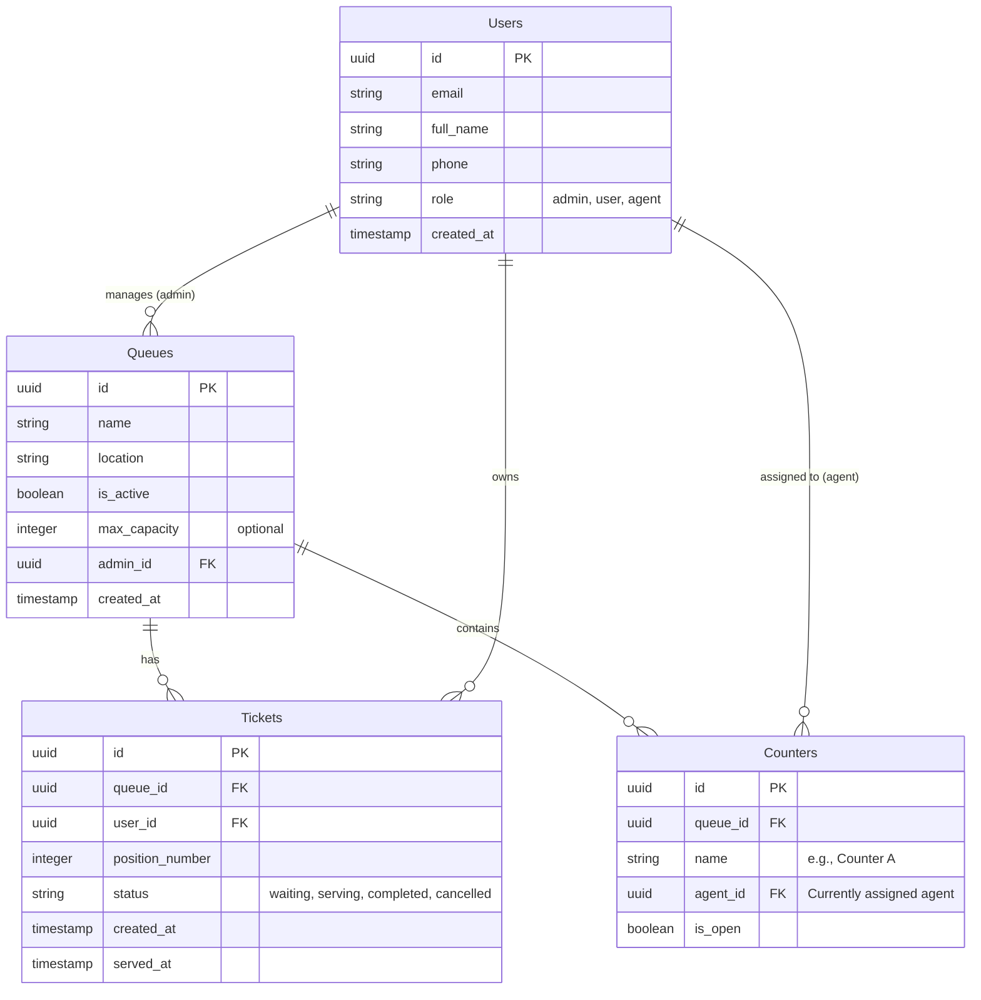

# Database Entity-Relationship Diagram (ERD)

This document maps the core database schema for the Smart Queue Management System (SQMS).

## Schema Details
1.  **Users:** Stores identity data. `role` dictates whether they access the Admin Dashboard or User Portal.
2.  **Queues:** Represents a specific line (e.g., "Main Branch - Tellers"). Managed by an admin.
3.  **Counters:** Represents a service desk. Links to a queue and a specific user (agent) currently servicing it.
4.  **Tickets:** The core entity. Tracks a user's position in a queue. Position determines order; status dictates current state.
